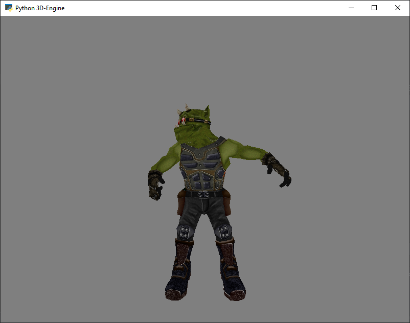

  

# Disclaimer
This is a small project to get back in some OpenGL development without the hassle to compile anything in C++ or anything else. It original started as a engine thing but right now it doesn't provide all the functionalities for it. It can load IQM-Files and display the animations (currently hard coded which to play) and provides basic collision functionality by using python and pyglet directly. It probably doesn't have a use case as a real engine since python is to slow for all the heavy math calculations (maybe if you use numpy instead of own classes). But anyway might be useful for someone who wants to understand the IQM-File or to get some understanding in 3D-Programming. Beside that I will probably update the code from time to time, if I want to expand it. Note that the source code isn't commented at all since it wasn't intended to be a professional program and has some inconsistency in styling as well (due to a big time gap between coding some parts) which I will address sometime in the future. Anyway I though that it could be useful for someone and I want to use git to keep track of my progress :P

## License
MIT license (see license.md)

## Libraries
- ctypes
- Pyglet
- Python 3.91

## Run
Just type in "python engine.py" in the engine folder and it should run. You can grab an IQM-Model to test things from the [SDK](https://github.com/lsalzman/iqm) and place it somewhere. You can then go to the "scene_manager.py" and load the file with the "MeshLoader"-Class or just uncomment the line which loads the IQM (check if the filepath matches with yours).
